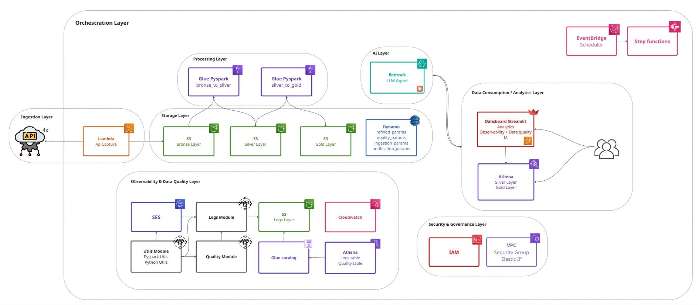

  # EpiMind Data Platform on AWS


A production-grade data platform that monitors arbovirus epidemiological data (like Dengue) in the state of São Paulo, Brazil. It ingests data through a Medallion Architecture, integrating Artificial Intelligence (AI) for advanced data querying, and serves analytics via a web Streamlit dashboard hosted on a custom domain. Fully deployed using Terraform (IaC) and automated via GitHub Actions CI/CD.

## Table of Contents

- [Live Dashboard](#live-dashboard)
- [Architecture Overview](#architecture-overview)
- [How It Works](#how-it-works)
- [Cloud Setup](#cloud-setup)
- [Technology Stack](#technology-stack)
- [Key Features](#key-features)
- [Documentation](#documentation)
- [Code Organization](#code-organization)
- [Infrastructure & CI/CD](#infrastructure--cicd)
- [Future Enhancements](#future-enhancements)

<a id="live-dashboard"></a>

## Live Dashboard 

**Access the dashboard:** [https://epimind.com.br/](https://epimind.com.br/)


Interactive analytics with three main sections:

- **Surveillance (Vigilância)** – View general indicators and a detailed epidemiological ranking of cities.
- **AI Analyst (IA Analista)** – Ask questions using natural language to an AI assistant powered by your Data Lake.
- **Observability** – Real-time logs showing successful pipeline runs, errors, and performance metrics.

Watch demo videos to see the dashboard in action:

- [Surveillance Dashboard Demo](docs/videos/Dashboard_vigilância.mp4)
- [AI Analyst Demo](docs/videos/Dasboard_IA.mp4)
- [Observability Logs Demo](docs/videos/Dashboard_observabilidade.mp4)

> [!NOTE]
> For detailed dashboard and AI documentation, see [Dashboard Guide](docs/dashboard.md).

<a id="architecture-overview"></a>

## Architecture Overview



The pipeline runs entirely on a serverless AWS stack, orchestrated by AWS Step Functions and provisioned using Terraform. 

- **Bronze** – Raw data from APIs, preserved in S3 for full reprocessability.
- **Silver** – PySpark-transformed [Parquet](https://parquet.apache.org/) files, partitioned for efficient querying.
- **Gold** – Pre-aggregated and modeled tables queryable via Athena.

> [!NOTE]
> [Full architecture documentation →](docs/architecture.md)

<a id="how-it-works"></a>

## How It Works

The automated pipeline is orchestrated by **AWS Step Functions**:

1. **Ingestion** – AWS Lambda extracts data via API and stores it in S3 Bronze.
2. **Transformations (Glue)** – AWS Glue jobs clean, partition, and transform data from Bronze to Silver, and then aggregate it into the Gold layer using Athena SQL.
3. **AI Integration** – The dashboard sends user queries to an AI service that dynamically translates natural language into insights over the curated data.
4. **Configuration Driven** – Glue jobs and Lambda functions are entirely driven by parameters stored in DynamoDB, meaning no code changes are required to add new tables.
5. **Observability** – Structured execution logs are written to an Athena table, providing full execution context and performance monitoring shown in the Streamlit app.

<a id="cloud-setup"></a>

## Cloud Setup ☁️

All components run on AWS infrastructure. 

> [!NOTE]
> A dedicated read-only user was created for you to safely explore the data lake. Access it with the credentials below.

```
AWS Console: https://580148408154.signin.aws.amazon.com/console
User: datalake-reader
```

Password: [Request access via WhatsApp](https://wa.me/5515997595138?text=Hi%2C+I%27d+like+to+request+the+read-only+AWS+console+password+for+the+EpiMind+project.)

With read-only access, you can:
- Browse S3 layers and Athena queries.
- View Step Functions executions.
- Access DynamoDB configuration tables.
- View Terraform state if applicable.

<a id="technology-stack"></a>

## Technology Stack

| Component | Technology |
|-----------|------------|
| **Cloud** | [AWS Lambda](https://docs.aws.amazon.com/lambda/), [Glue](https://docs.aws.amazon.com/glue/), [Athena](https://docs.aws.amazon.com/athena/), [S3](https://docs.aws.amazon.com/s3/), [DynamoDB](https://docs.aws.amazon.com/dynamodb/), [Step Functions](https://aws.amazon.com/step-functions/) |
| **IaC & CI/CD**| [Terraform](https://www.terraform.io/), [GitHub Actions](https://github.com/features/actions) |
| **Orchestration** | AWS Step Functions |
| **Processing** | Python, PySpark, SQL |
| **Dashboard** | Streamlit, hosted on EC2 with a custom domain (registro.br) |
| **Data Format** | [Parquet](https://parquet.apache.org/) |

<a id="key-features"></a>

## Key Features

**Terraform IaC & CI/CD** – The entire AWS infrastructure is mapped as code and automatically deployed via GitHub Actions pipelines.

**AWS Step Functions** – Serverless orchestration for all ETL steps, providing visual state machines and eliminating the overhead of managing Apache Airflow.

**AI Integration** – Seamless connection with LLMs within the dashboard to translate human questions into data insights.

**Configuration-driven Pipeline** – All transformations and ingestion schemas are parameterized in DynamoDB tables.

**Custom Domain Setup** – The dashboard is exposed professionally via `epimind.com.br`, managed through `registro.br` and AWS.

<a id="documentation"></a>

## Documentation

- [Architecture](docs/architecture.md) – Design patterns, data flow, component details.
- [Dashboard & AI](docs/dashboard.md) – Using Streamlit analytics and the IA Analyst.
- [Infrastructure & CI/CD](docs/infrastructure.md) – Terraform configuration, Step Functions, and GitHub Actions.

<a id="code-organization"></a>

## Code Organization 📂

- `aws/terraform/` – Infrastructure as Code definitions.
- `aws/step_functions/` – Step Functions definitions.
- `aws/scripts/` – AWS Lambda and Glue Python scripts.
- `aws/sql/` – Athena queries for Gold layer aggregation.
- `aws/dynamo_params/` – Configurations loaded into DynamoDB.
- `streamlit_app/` – Streamlit analytics interface and AI logic.
- `.github/workflows/` – CI/CD automation pipelines.

<a id="infrastructure--cicd"></a>

## Infrastructure & CI/CD

The whole project runs as Code. See the [Infrastructure Guide](docs/infrastructure.md) for how Terraform manages the deployment, and how GitHub Actions automates changes to Lambdas, Glue, and the Step Functions workflow.

<a id="future-enhancements"></a>

## Future Enhancements

- **Data Quality Framework** – Implementing quality validation tests across all layers (expected soon).
- **Neighborhood-level Analysis** – Expanding data granularity to provide localized maps.

---

## Questions or Feedback

Thanks for reading! If you have any questions about the pipeline or would like to discuss the architecture, feel free to reach out.

**Contact:**
- Email: brun0ws@outlook.com
- LinkedIn: [Bruno Silva](https://www.linkedin.com/in/brunowds/)
- WhatsApp: [Message me](https://wa.me/5515997595138)
