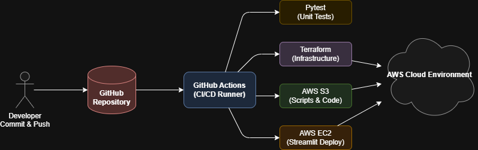

# Infrastructure & CI/CD

Unlike previous pipeline architectures that relied on manual configurations or container-based orchestrators like Airflow, the EpiMind project fully embraces **Infrastructure as Code (IaC)** and **Continuous Deployment (CI/CD)**. This ensures our cloud environment is reproducible, secure, and entirely automated.

---

## What is Terraform?

**[Terraform](https://developer.hashicorp.com/terraform/intro)** is an open-source Infrastructure as Code (IaC) software tool created by HashiCorp. It allows you to define both cloud and on-premise resources in human-readable configuration files that you can version, reuse, and share. 
*Learn more:* [What is Infrastructure as Code? (AWS Guide)](https://aws.amazon.com/what-is/iac/)

**What Terraform does in this project:**
Instead of clicking through the AWS Console to create tables and grant permissions, Terraform reads our `.tf` files located in the [`aws/terraform/`](../aws/terraform/) directory and talks directly to the AWS API to provision exactly what we need. 

- **Reproducibility:** Anyone can deploy the entire stack from scratch in minutes.
- **State Management:** AWS resources are tracked. If a resource is deleted manually, Terraform knows and recreates it.
- **Least Privilege:** IAM roles, policies, and permissions are explicitly defined and locked down in code.

---

## The Difference Between Terraform and GitHub Actions

It's common to confuse the roles of Terraform and GitHub Actions. Here is how they work together in EpiMind:

- 🏗️ **Terraform is the Architect & Builder:** It knows *what* to build. It reads your `.tf` blueprints and talks to AWS to create the infrastructure (S3 buckets, DynamoDB tables, Lambda empty shells, IAM roles). However, Terraform does not run by itself.
- 🚚 **GitHub Actions is the Delivery Manager & Automator:** It knows *when* to build and ensures safety. It is a runner that watches your code on GitHub. When you push a code update, GitHub Actions wakes up, runs your `pytest` unit tests, and then **commands Terraform** to apply the changes to AWS.

### How it applies to your daily workflow:
1. **Changing a Python Code (`.py`):** If you edit `BronzeApiCaptureInfoDengue.py`, Terraform doesn't care about the Python code itself. GitHub Actions steps in, runs the tests, zips the code, and uploads it straight to S3 and Lambda.
2. **Adding a new AWS Resource (`.tf`):** If you need a new DynamoDB table, you write Terraform code. But you **don't** run `terraform apply` on your local laptop. You just push to GitHub. GitHub Actions logs into AWS securely on the cloud, installs Terraform, and runs the command for you.

> **In other words:** If you edit an IAM policy, a DynamoDB table, or a Step Function locally, all you have to do is run `git push`. GitHub Actions will automatically call Terraform to update the infrastructure in the cloud. If you edit a Python script, GitHub Actions handles the deployment itself by running the tests and uploading the code. You never have to run manual deployment commands or click buttons in the AWS Console.

> [!NOTE]
> Want to see the interactive flowchart? [Open Interactive Diagram in Browser](img/04_cicd/01_pipeline_flowchart.drawio.html)

### The 5 Modular Workflows

Instead of one massive pipeline, we split our CI/CD into 5 focused workflows. This saves build minutes and ensures we only deploy what changed. You can view the original YAML configurations here:

1. **[`aws_iam_policies.yml`](../.github/workflows/aws_iam_policies.yml)**
   - **What it does:** Updates IAM Roles and Policies using Terraform.
   - **Why:** Separated for security. Modifying permissions is critical and tracked independently.

2. **[`aws_scripts.yml`](../.github/workflows/aws_scripts.yml)**
   - **What it does:** Runs all `pytest` unit tests. If tests pass, it zips and uploads PySpark scripts, Lambda functions, and shared Python modules straight to S3.
   - **Why:** This is the core application logic deployer.

3. **[`terraform_dynamodb.yml`](../.github/workflows/terraform_dynamodb.yml)**
   - **What it does:** Applies Terraform state specifically for the DynamoDB configuration tables.

4. **[`terraform_step_functions.yml`](../.github/workflows/terraform_step_functions.yml)**
   - **What it does:** Applies Terraform state to build and link the AWS Step Functions state machine.

5. **[`ec2_streamlit.yml`](../.github/workflows/ec2_streamlit.yml)**
   - **What it does:** Connects to the AWS EC2 instance via SSH, pulls the latest GitHub repository, rebuilds the Docker container, and restarts the Streamlit server.
   - **Why:** Ensures zero-downtime updates to the web dashboard.
