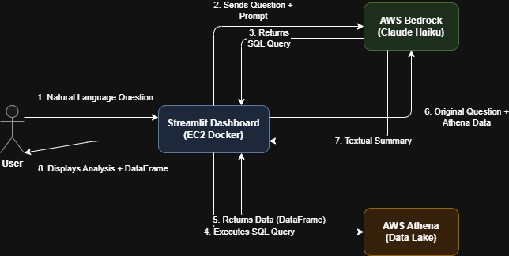
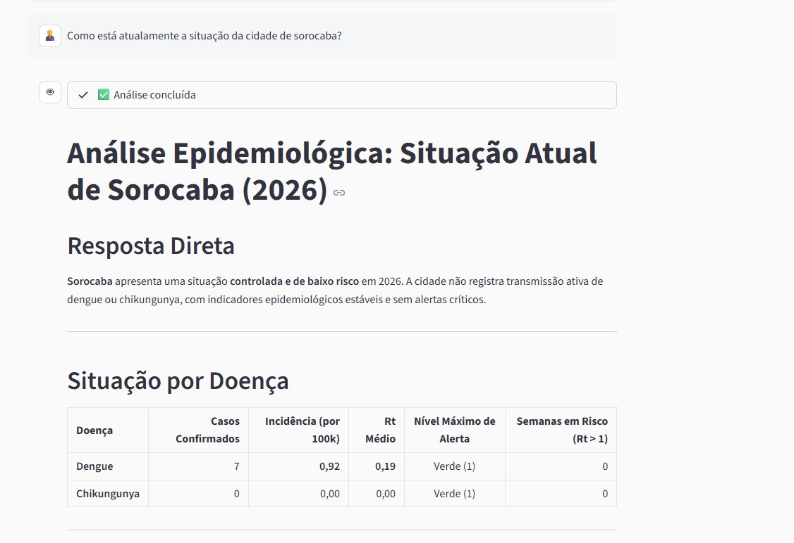

# AI Guide (IA Analista)

A unique feature of the EpiMind project is the integration of an AI Assistant that understands the underlying AWS architecture, the epidemiological context, and the data schemas. 

Users can ask complex questions using natural language to extract deep insights without writing a single line of SQL.

---

## 🔄 How It Works (Architecture Flow)

The integration uses a multi-step orchestration entirely managed in Python via Streamlit and `boto3`.

> [!NOTE]
> Want to see the interactive flowchart? [Open Interactive Diagram in Browser](img/03_ai_analyst/01_flowchart.drawio.html)

1. **User Prompt:** The user types a question in the Streamlit UI.
2. **Schema Injection:** The backend injects the Athena schema (tables, column definitions, available cities, and thresholds) into the LLM context.
3. **Query Generation:** The LLM translates the question into an optimized Athena SQL query.
4. **Execution:** The system executes the query securely on the Data Lake via [`PyAthena`](https://pypi.org/project/PyAthena/).
5. **Answer Generation:** The LLM receives the numerical/categorical results from Athena and summarizes them in a human-readable format.

> *"What is the current dengue situation in Sorocaba?"*

---

## 🧠 Model Selection & Costs

The AI Analyst is powered by **Anthropic Claude Haiku**, provisioned via **AWS Bedrock** (`global.anthropic.claude-haiku`).

**Why Claude Haiku?**
- **Speed:** It is optimized for near-instant responses, which is critical for maintaining a fluid, interactive dashboard experience.
- **Cost-Efficiency:** As an enterprise dashboard, scanning large Athena tables and hitting LLM APIs can add up quickly. Claude Haiku offers excellent reasoning capabilities for SQL generation at a fraction of the cost of heavier models (costing roughly **$0.25 per million input tokens**).

---

## 🚦 Usage Limits

To prevent abuse and tightly control AWS costs (both from Bedrock API calls and Athena Data Scanned), the platform implements a strict throttle:
- **5 Questions per User:** Once a user reaches 5 interactions, the chat input is gracefully disabled. This limit guarantees that the cloud expenditure for the demonstration environment remains highly predictable and sustainable.

---

## 🛡️ Smart Filtering (Out of Scope Guardrails)

Because interacting with the database costs compute resources, the AI is configured with strict guardrails within its system prompt.

If a user asks a question entirely unrelated to epidemiology or outside the available arbovirus data scope, the AI intelligently flags it as out-of-scope and refuses to execute an Athena query.

This protects the system from "hallucinated" queries and unnecessary AWS Athena scan costs.

[Watch AI Analyst Demo](videos/Dasboard_IA.mp4)

---

## 🕵️‍♂️ Under the Hood: Prompts & Code

For curiosity, below are the actual prompts and Python source code that orchestrate the AI Analyst pipeline.

- **System Prompt & Rules**: [`analista_prompt.yaml`](../streamlit_app/services/prompts/analista_prompt.yaml) — Dictates the persona, strict table selection rules, and mathematical risk formulas, ensuring the AI never hallucinates random logic.
- **Data Dictionary**: [`data_dictionary.yaml`](../streamlit_app/services/prompts/data_dictionary.yaml) — The injected schema that teaches the AI how to query Athena correctly.
- **LLM Orchestration**: [`bedrock_service.py`](../streamlit_app/services/bedrock_service.py) — The Python service handling the connection with `boto3`, executing the two-step chain, and enforcing regex-based SQL safety validation before hitting Athena.

---

> [!NOTE]
> For more information on the overall dashboard interface, data visualizations, and network flow, please see the [Dashboard Guide](dashboard.md).
