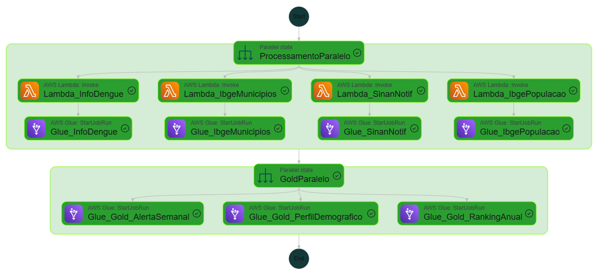
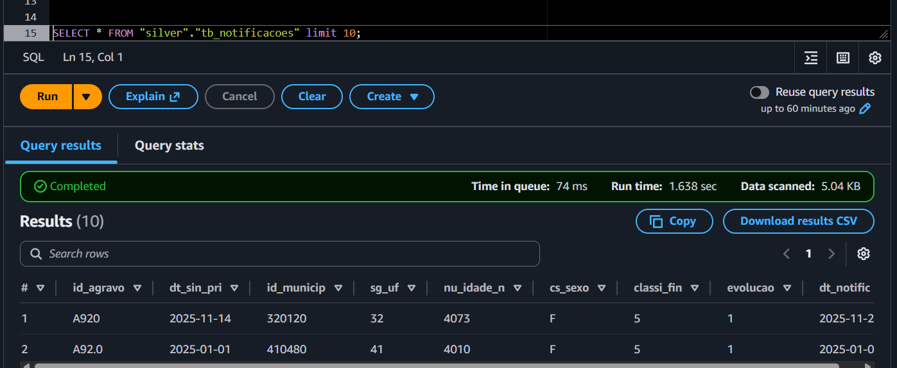
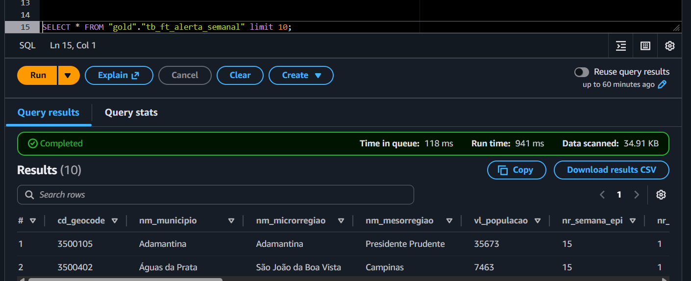
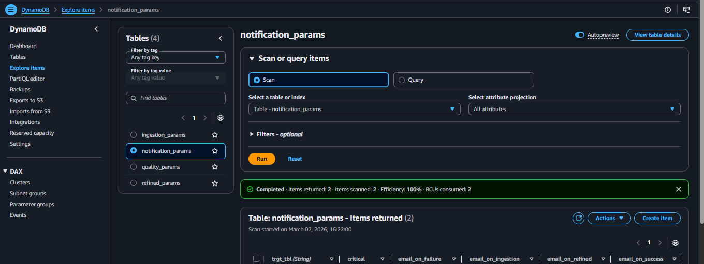

# Architecture

This document outlines the data engineering pipeline for the EpiMind project, covering data extraction, processing, and consumption.

## Architecture Diagram


---

## Orchestration — AWS Step Functions

Instead of managing an Airflow cluster, this project uses **AWS Step Functions** for serverless orchestration. It provides visual workflows, error handling, and automated retries out-of-the-box.

The state machine coordinates the workflow: extracting data via Lambda, passing execution parameters, and triggering Glue jobs for transformation.

**EventBridge Trigger:** The entire pipeline is scheduled via AWS EventBridge, triggering the Step Functions state machine automatically every Sunday (`cron(0 0 ? * SUN *)`).

[View Step Function Pipeline Definition](../aws/terraform/step_functions/)



---

## Ingestion — AWS Lambda

[AWS Lambda](https://docs.aws.amazon.com/lambda/latest/dg/welcome.html) is used for data ingestion. It hits external APIs to fetch the latest epidemiological data and stores it in the Bronze S3 bucket. The functions are fully configuration-driven, meaning the API endpoints, pagination logic, and target paths are retrieved dynamically from DynamoDB at runtime.

The pipeline captures data from the following sources:
- **InfoDengue API**: Real-time epidemiological data for arboviruses (`BronzeApiCaptureInfoDengue.py`)
- **IBGE Municipalities API**: Master data of cities and states (`BronzeApiCaptureIbgeMunicipios.py`)
- **IBGE Population API**: Yearly population census data (`BronzeApiCaptureIbgePopulacao.py`)
- **SINAN Data**: Historical health records (`BronzeS3CaptureSinan.py`)

**Target bucket:** `bws-dl-bronze-sae-prd`

**S3 path pattern:**
```text
<source>/<table_name>/ingestion_date=YYYY-MM-DD/data_HHMMSS.json
```

After the upload completes, the function returns `filename` and `ingestion_date` to Step Functions, which then passes these arguments into the downstream Glue jobs.

**Retry logic:** On HTTP errors or timeouts, each request retries up to 3 times with exponential backoff before raising an exception.

**Notifications** are configured via the `notification_params` table in DynamoDB. This table controls which email addresses receive alerts on failure, warning, or success.

> [!NOTE]
> For DynamoDB parameter details, see [dynamo_params.md](dynamo_params.md). For shared module documentation, see [modules.md](modules.md).

**Scripts:** `aws/scripts/lambda_scripts/` 
 
---

## Data Lake Layers (Medallion Architecture)

### Bronze Layer — Raw Data

Raw data is landed in S3 in its original format (e.g., JSON or CSV). This acts as a historical source of truth, enabling reprocessing of the data without re-fetching from the source API.

### Silver Layer — AWS Glue (PySpark)

The Glue job `bronze_to_silver` reads the JSON ro CSV file from the Bronze layer and converts it into [Parquet](https://parquet.apache.org/) format. Parquet is a columnar storage format that reduces query costs and execution time on Athena significantly compared to JSON — particularly when filtering on specific columns.

Data is written to the Silver bucket partitioned by **date** (and location where applicable), so queries only scan the relevant partitions instead of the full dataset.

**What this job does:**
- Reads the exact file passed by Step Functions (`--file_name` and `--dt_ref`)
- Applies schema casting, null handling, and column standardization
- Runs data quality checks configured in DynamoDB (`quality_params`) using the Quality module
- Writes the clean result as Parquet, properly partitioned.

**Designed as a generic processing engine:** 
This job reads all its configuration from DynamoDB (`ingestion_params`) — source paths, schema definitions, quality rules. Pass it different parameters and it processes a completely different dataset without any code changes. This makes it reusable across multiple ingestion pipelines.

> [!NOTE]
> For DynamoDB parameter details, see [dynamo_params.md](dynamo_params.md). For shared module documentation, see [modules.md](modules.md).

**Script:** `aws/scripts/glue_scripts/bronze_to_silver.py`



### Gold Layer — Aggregation and Analytics - (PySpark)

The Glue job `silver_to_gold` reads clean Silver data and produces pre-aggregated tables in the Gold layer. Instead of hardcoding the transformation logic inside the job, the SQL query is stored as a `.sql` file in S3 and loaded at runtime. This keeps business logic versioned and separated from execution code.

The job runs that SQL using Athena to create business-ready metrics. These pre-aggregated tables are stored in Parquet format, ensuring fast and cost-efficient reads. 

**What the SQL does:**
Groups epidemiological cases by city, state, and disease type, calculating thresholds, incidence rates, and population metrics. This powers the main analytics view and the AI module in the Streamlit dashboard.

**Column naming conventions:**
The Gold table follows a structured naming convention to make the schema self-explanatory and governance-friendly. Column prefixes communicate the nature of each field at a glance:
- `nm_` — name or descriptive label (e.g., `nm_city`, `nm_state`, `nm_disease`)
- `qtd_` — quantity or count (e.g., `qtd_cases`, `qtd_population`)
- `vl_` — numerical value or metric (e.g., `vl_incidence_rate`)

**Also a generic engine:**
Like the Bronze to Silver job, configuration is pulled from DynamoDB (`refined_params`). Point it at a different SQL file and target table, and it processes an entirely different aggregation without touching the code.

> [!NOTE]
> For DynamoDB parameter details, see [dynamo_params.md](dynamo_params.md). For shared module documentation, see [modules.md](modules.md).

**Script:** `aws/scripts/glue_scripts/silver_to_gold.py`



---

## Dashboard — Streamlit & AI

After the Gold layer is ready, the data is immediately available for the Streamlit application. 

The dashboard runs in a **Docker container** on an EC2 instance, making it fully available on the public web. It provides visual filters, maps, and an **AI Analyst** capable of answering natural language questions by dynamically translating them into Athena SQL queries based on the database schema.


> [!NOTE]
> For detailed instructions on the UI, see [Dashboard Guide](dashboard.md).
> To understand how the Artificial Intelligence connects to Athena, see [AI Guide](ai_guide.md).

---

## Observability and Configuration

### Configuration via DynamoDB

To ensure the codebase remains DRY (Don't Repeat Yourself), all pipelines pull their configuration from **DynamoDB**.



- **Execution Parameters**: Table definitions, paths, and metadata.
- **Data quality tests parameters**: Table definitions, paths, and metadata.
- **Notifications**: Control over who receives alerts on job success or failure. 

> [!NOTE]
> For DynamoDB parameter details, see [dynamo_params.md](dynamo_params.md)

### Centralized Logging & Data Quality

Every component in the pipeline — Lambda and both Glue jobs — uses a centralized `Logs` module to write structured execution records to a dedicated Athena table (`execution_logs`), partitioned by execution date. Each record includes the job name, target table, layer, execution status, step-level timing, and any warnings or errors captured during the run.

Data quality validations are handled by the `Quality` module, built on top of Great Expectations. It runs configurable checks — null rates, uniqueness, regex patterns, range validations — and writes the results to a separate `quality_logs` table in Athena. On failure or warning, it sends an email notification via SES and can optionally halt the job.

This custom observability approach is the primary way to monitor the pipeline. CloudWatch is also active and captures infrastructure-level metrics for Lambda invocations and Glue job runs, but the execution and quality logs in Athena give far more context for debugging and auditing.

> [!NOTE]
> For full logging and quality module documentation, see [modules.md](modules.md).


---

## Security

Access control is handled through [AWS IAM](https://docs.aws.amazon.com/iam/latest/userguide/introduction.html) roles and policies, following the principle of least privilege. Each service (Lambda, Glue, Step Functions, EC2) has its own IAM role with only the permissions it actually needs.

The EC2 instance sits inside a [VPC](https://docs.aws.amazon.com/vpc/latest/userguide/what-is-amazon-vpc.html) with a [security group](https://docs.aws.amazon.com/vpc/latest/userguide/vpc-security-groups.html) that controls which ports and IPs can reach it. Port 80 (Nginx Proxy) is public to serve the application securely. A fixed [Elastic IP](https://docs.aws.amazon.com/AWSEC2/latest/UserGuide/elastic-ip-addresses-eip.html) ensures the instance address stays stable for DNS resolution via Registro.br. 

All S3 data is encrypted at rest using [AWS SSE](https://docs.aws.amazon.com/AmazonS3/latest/userguide/ServerSideEncryption.html). DynamoDB tables are encrypted using [AWS KMS](https://docs.aws.amazon.com/kms/). All infrastructure and security controls are provisioned programmatically via **Terraform**.

---

## Data Dictionary & Table Reference

For a complete breakdown of all the tables in the Silver and Gold layers, including partition strategies, column details, update frequencies, and useful SQL query examples (Cheat Sheet), please refer to the dedicated tables guide.

> [!NOTE]
> View all table schemas and query examples at [tables.md](tables.md).
