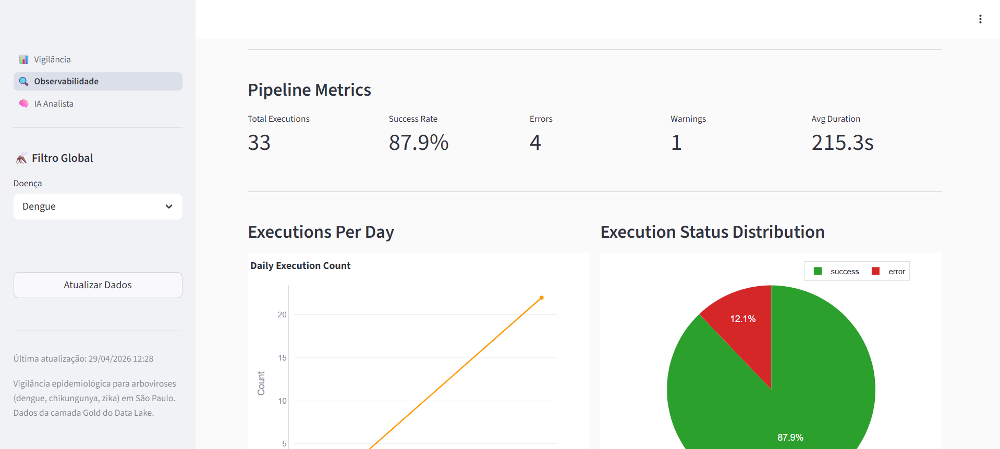
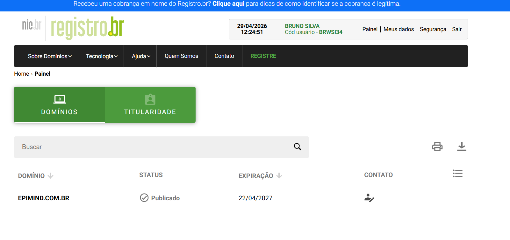

# Dashboard & AI Integration

The Streamlit dashboard serves as the front-end for the EpiMind platform. It connects directly to Athena to fetch curated data, provides observability logs, and features a smart AI Analyst capable of answering epidemiological questions in natural language.

**Live dashboard:** [https://epimind.com.br/](https://epimind.com.br/)

The platform has three main sections.

---

## 1. Surveillance (Vigilância)

This tab visualizes the Gold layer tables, allowing users to drill down into the data across different cities and timeframes.

**General Overview:**
Provides KPIs and graphs about disease incidence.

**Ranking & Critical Analysis:**
Calculates risk scores based on disease thresholds and population data.

[Watch Surveillance Demo](videos/Dashboard_vigilância.mp4)

---

## 2. AI Analyst (IA Analista)

A unique feature of this project is the integration of an AI Assistant that understands the underlying AWS architecture and the data schemas. 

Users can ask complex questions such as:
> *"What is the current dengue situation in Sorocaba?"*

**Smart Filtering (Out of Scope):**
The AI is configured with guardrails. If a user asks a question entirely unrelated to epidemiology or the available arbovirus data, it courteously refuses to answer, protecting system resources and avoiding database hallucinations.

[Watch AI Analyst Demo](videos/Dasboard_IA.mp4)

---

## 3. Observability (Observabilidade)

A centralized view of pipeline health. It reads directly from the `execution_logs` table in Athena to show:
- Whether Step Functions, Lambdas, and Glue jobs succeeded or failed.
- The amount of data processed per run.
- Time spent on each step.

[Watch Observability Demo](videos/Dashboard_observabilidade.mp4)

---

## Custom Domain Setup

The dashboard is professionally hosted on an EC2 instance, and its DNS is fully managed via a custom domain (`epimind.com.br`) registered in **registro.br** and routed through AWS.

