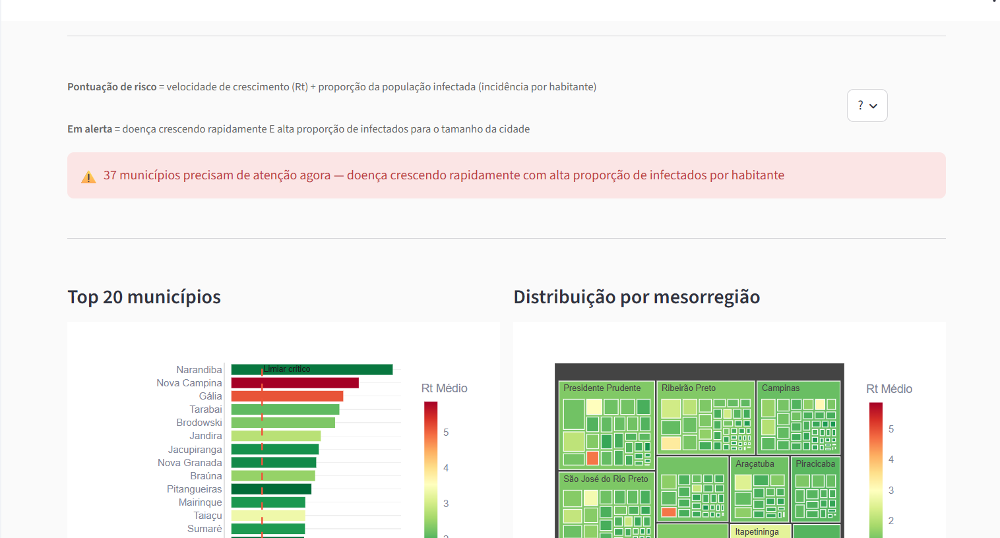
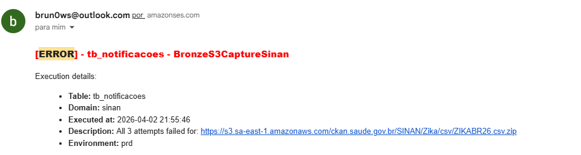
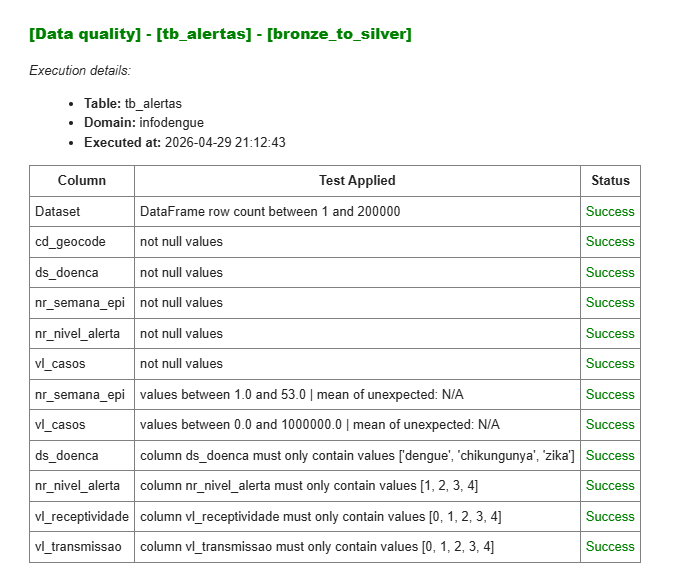

# 📊 EpiMind Dashboard

The web interface for EpiMind is not just a visualization tool; it is a full-fledged web application designed to bring the power of the AWS Data Lake directly into the hands of epidemiologists and public health officials.

Built entirely in **[Streamlit](https://streamlit.io/)**, the application allows for rapid iteration of data products using pure Python. The dashboard bypasses traditional, sluggish BI tools by querying the Data Lake directly, offering a custom, interactive experience.

**Live Project:** [https://epimind.com.br/](https://epimind.com.br/)  
**Source Code:** [`streamlit_app/`](../streamlit_app/)

---

## 1. 🔍 Surveillance & Analytics (Vigilância)

This tab visualizes the Gold layer tables, allowing users to drill down into the data across different cities and timeframes. 

* **General Overview:** Provides KPIs and interactive graphs about disease incidence.
  
  
* **Ranking & Critical Analysis:** Calculates risk scores dynamically based on disease thresholds, RT indicators, and population data.
  

> 🎥 [Watch Surveillance Demo](videos/Dashboard_vigilância.mp4)

---

## 2. 🤖 AI Analyst (IA Analista)

*(For deep technical details on Prompts and AWS Bedrock orchestration, please see the [AI Guide](ai_guide.md))*

The dashboard features an integrated AI assistant. Users can type epidemiological questions in natural language, and the Streamlit app orchestrates the prompt to generate secure SQL, queries the data lake, and returns a human-readable analysis.

---

## 3. 📉 Observability (Observabilidade)

A centralized, real-time view of pipeline health. Because EpiMind is built with a custom logging framework, this tab reads directly from the `execution_logs` and `quality_logs` tables in Athena to show:
- Whether Step Functions, Lambdas, and Glue jobs succeeded, threw warnings, or failed.
- The amount of records processed per run.
- Time spent on each extraction and transformation step.

### Proactive Alerting & Data Quality (AWS SES & DynamoDB)

While the dashboard provides a macroscopic view, the platform is equipped with proactive alerting via Amazon Simple Email Service (SES) and an automated Data Quality (DQ) module. 

**Zero-Hardcoding Architecture**: 
The engineering design ensures that neither the DQ validation rules nor the alerting email addresses are hardcoded in the Python scripts. Instead, the pipelines dynamically read constraints and routing configurations from DynamoDB parameters.
For instance, the recipients of these alerts are dynamically configured in the [notification_params.json](../aws/dynamo_params/notification_params.json) configuration table.

If an anomaly is detected during data ingestion (e.g., an external API goes down or an S3 file is missing), the pipeline immediately halts and dispatches an **Error Notification** to the configured engineering team:

### 🛡️ Business Data Quality (BDQ) Framework

To guarantee the reliability of the epidemiological insights shown on the dashboard, EpiMind relies on a robust **Business Data Quality (BDQ)** pipeline. This is handled by a custom Python module ([quality.py](../aws/modules/quality.py)) which wraps the industry-standard **Great Expectations** framework.

**Why BDQ is Critical:**
BDQ tests act as an automated firewall against corrupted health data. They are highly effective for catching anomalies before they reach the dashboard, such as:
- External government APIs dropping crucial columns (e.g., missing dengue case counts).
- Truncated downloads or sudden data volume drops (`df_count` anomalies).
- Unexpected categories or out-of-range historical data (e.g., negative cases, invalid IBGE city codes).

By preventing "garbage in, garbage out", BDQ ensures the Dashboard only renders verified, trustworthy epidemiological alerts.

Furthermore, when a table is registered for BDQ constraints in DynamoDB, the pipeline automatically dispatches a detailed **Data Quality Report** via email. This allows stakeholders to have immediate confidence in the data being promoted to the Silver and Gold layers:

> **📖 Deep Dive:** For more technical information on how to configure or extend these data quality tests, check the official documentation at **[Modules Guide > quality.py](modules.md#qualitypy)**.
> 🎥 [Watch Observability Demo](videos/Dashboard_observabilidade.mp4)

---

## 4. ⚙️ Engineering: How It Works Under the Hood

The dashboard is built to scale and doesn't rely on static, cached extracts. It talks directly to the cloud.

### Fast Queries with PyAthena
The Streamlit app connects to the Data Lake using **[PyAthena](https://github.com/laughingman7743/PyAthena)**. Whenever a user applies a filter on the UI or asks the AI a question, the app executes a highly optimized SQL query against the Parquet-partitioned Gold layer in AWS Athena, returning analytical results in seconds.

### Docker Containerization
The entire application is containerized to ensure it runs exactly the same way in production as it does on a developer's machine. This guarantees that dependencies never conflict.
*See the configuration in:* [`streamlit_app/Dockerfile`](../streamlit_app/Dockerfile)

### AWS EC2 & Networking
The dashboard is professionally hosted on an **[AWS EC2](https://aws.amazon.com/ec2/)** instance, making it robust and fully available on the web without specifying messy ports.

**How the routing works:**
1. **DNS Registration:** The custom domain `epimind.com.br` is registered and managed via **Registro.br**.
2. **DNS Resolution:** The domain points to the AWS Elastic IP attached to our EC2 instance.
3. **Nginx Reverse Proxy:** Incoming web traffic hits the EC2 instance, where **Nginx** is listening on port 80. Nginx acts as a reverse proxy, securely forwarding requests directly to the Streamlit Docker container running internally on port 8501.

This architecture provides a clean URL, a secure entry point, and enterprise-grade reliability.
