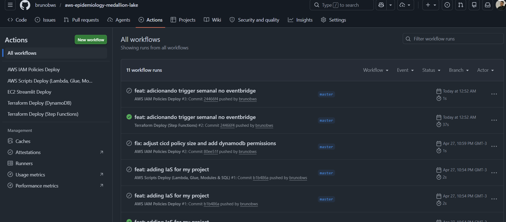

# Infrastructure & CI/CD

Unlike previous versions of our pipeline architectures that relied heavily on manual configurations or container-based orchestrators like Airflow, the EpiMind project fully embraces **Infrastructure as Code (IaC)** and **Continuous Deployment**.

---

## Terraform (Infrastructure as Code)

All AWS resources are defined using **Terraform**. This ensures:
- **Reproducibility:** Anyone can deploy the entire stack from scratch in minutes.
- **State Management:** AWS resources are tracked and updated efficiently without UI clicks.
- **Security:** IAM roles, policies, and permissions are explicitly defined in code, following the principle of least privilege.

The Terraform configuration is modularized, handling DynamoDB tables, Step Functions, S3 buckets, IAM roles, and Glue jobs simultaneously.

---

## CI/CD with GitHub Actions

We use **GitHub Actions** to automate our deployments.

Whenever a push is made to the repository, the CI/CD pipeline triggers. It validates the code and applies changes directly to AWS.

**What the pipeline does:**
1. Separates deployments for infrastructure (Terraform) and application (Streamlit / Scripts).
2. Deploys updated AWS Lambdas and Glue scripts to S3 automatically.
3. Applies Terraform changes safely to the AWS account.
4. Restarts application servers if needed to reflect the latest UI changes.

This ensures zero-downtime updates and maintains a strict version-controlled record of every infrastructure change.

---

## AWS Step Functions Orchestration

We transitioned from Apache Airflow to **AWS Step Functions**.

**Why?**
- **Serverless:** No EC2 instances to maintain just for orchestration.
- **Native Integration:** Direct, seamless triggering of Lambdas and Glue jobs.
- **Visual Workflows:** Step Functions provide a clear UI to track the flow of data and visually identify exactly where failures happen.

Step Functions manage the flow of the entire Medallion Architecture, executing tasks step-by-step and providing built-in retry and catch mechanisms for transient errors.
