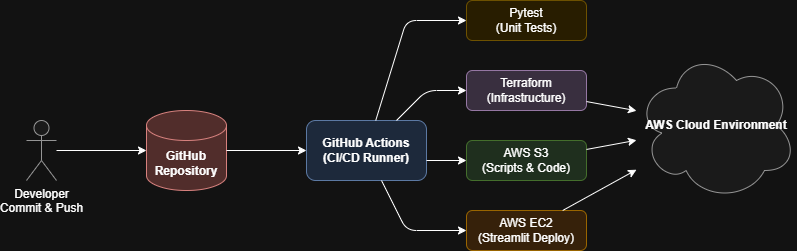

# Infrastructure & CI/CD

Unlike previous pipeline architectures that relied on manual configurations or container-based orchestrators like Airflow, the EpiMind project fully embraces **Infrastructure as Code (IaC)** and **Continuous Deployment (CI/CD)**. This ensures our cloud environment is reproducible, secure, and entirely automated.

---

## 🏗️ What is Terraform?

**[Terraform](https://developer.hashicorp.com/terraform/intro)** is an open-source Infrastructure as Code (IaC) software tool created by HashiCorp. It allows you to define both cloud and on-premise resources in human-readable configuration files that you can version, reuse, and share. 
*Learn more:* [What is Infrastructure as Code? (AWS Guide)](https://aws.amazon.com/what-is/iac/)

**What Terraform does in this project:**
Instead of clicking through the AWS Console to create tables and grant permissions, Terraform reads our `.tf` files located in the [`aws/terraform/`](../aws/terraform/) directory and talks directly to the AWS API to provision exactly what we need. 

- **Reproducibility:** Anyone can deploy the entire stack from scratch in minutes.
- **State Management:** AWS resources are tracked. If a resource is deleted manually, Terraform knows and recreates it.
- **Least Privilege:** IAM roles, policies, and permissions are explicitly defined and locked down in code.

---

## 🚀 CI/CD with GitHub Actions

We use **[GitHub Actions](https://docs.github.com/en/actions)** as our CI/CD runner. While Terraform creates the "empty houses" (buckets, roles, functions), GitHub Actions handles putting the "furniture" inside (uploading code, running tests, syncing configurations).

Whenever a developer pushes code to the `master` branch, GitHub Actions is triggered automatically.

> **In other words:** If you change an IAM policy, update a Python script, or modify a DynamoDB table configuration locally and run `git push`, the changes will automatically pass through GitHub Actions. The pipeline runs the tests, invokes Terraform, and pushes the updates directly to AWS with zero manual intervention.

> [!NOTE]
> Want to see the interactive flowchart? [Open Interactive Diagram in Browser](img/04_cicd/01_pipeline_flowchart.drawio.html)

### The 5 Modular Workflows

Instead of one massive pipeline, we split our CI/CD into 5 focused workflows. This saves build minutes and ensures we only deploy what changed. You can view the original YAML configurations here:

1. 🔐 **[`aws_iam_policies.yml`](../.github/workflows/aws_iam_policies.yml)**
   - **What it does:** Updates IAM Roles and Policies using Terraform.
   - **Why:** Separated for security. Modifying permissions is critical and tracked independently.

2. 📜 **[`aws_scripts.yml`](../.github/workflows/aws_scripts.yml)**
   - **What it does:** Runs all `pytest` unit tests. If tests pass, it zips and uploads PySpark scripts, Lambda functions, and shared Python modules straight to S3.
   - **Why:** This is the core application logic deployer.

3. 🗄️ **[`terraform_dynamodb.yml`](../.github/workflows/terraform_dynamodb.yml)**
   - **What it does:** Applies Terraform state specifically for the DynamoDB configuration tables.

4. ⚙️ **[`terraform_step_functions.yml`](../.github/workflows/terraform_step_functions.yml)**
   - **What it does:** Applies Terraform state to build and link the AWS Step Functions state machine.

5. 🖥️ **[`ec2_streamlit.yml`](../.github/workflows/ec2_streamlit.yml)**
   - **What it does:** Connects to the AWS EC2 instance via SSH, pulls the latest GitHub repository, rebuilds the Docker container, and restarts the Streamlit server.
   - **Why:** Ensures zero-downtime updates to the web dashboard.
