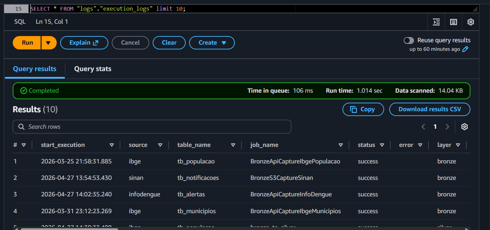
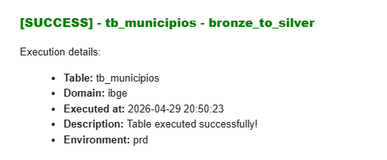

# Modules

This document covers the shared Python modules used across the Lambda function and both Glue jobs. They live in [aws/modules/](../aws/modules/) and are designed to be imported directly in any job without duplication.

Each module has a single responsibility — logging, AWS service access, quality checks, or Spark utilities. They communicate through composition: the Quality and Pyspark modules depend on AwsManager; AwsManager lazily initializes the individual service classes; and all of them can optionally receive a `Logs` instance to write execution steps.

---

## logs.py

Source: [aws/modules/logs.py](../aws/modules/logs.py)

The `Logs` class is responsible for structured execution logging across Lambda and Glue jobs. It is instantiated once per job run and builds a single execution record that gets written to S3 as Parquet when the job finishes.

**How it works:**
- On instantiation, it generates a unique `execution_id` using SHA-256 (combining job name, target table, and start timestamp), captures the execution start time in UTC-3, and builds a base log record.
- Throughout the job, `add_info()` enriches the record with arbitrary key-value metadata — file names, row counts, flags like `critical` or `has_bdq`.
- `time_execution_step(step_name)` records the elapsed time since the last checkpoint and resets the internal timer, producing step-level timing entries automatically.
- On success, `write_log()` stamps the end time, serializes the `info` dict, builds a one-row Pandas DataFrame, and writes it as Parquet to `s3://bws-dl-logs-sae1-{env}/execution_logs/dt_ref=YYYY-MM-DD/{execution_id}.parquet`. It then triggers an Athena `MSCK REPAIR TABLE` so the new partition is immediately queryable.
- On error, `error()` calls `write_log()` automatically so the failure is captured even if the job is about to raise an exception.

**Log record fields:**

| Field | Description |
|---|---|
| `start_execution` | Job start timestamp (UTC-3) |
| `end_execution` | Job end timestamp |
| `source` | Source domain parsed from `target_table` |
| `table_name` | Table name parsed from `target_table` |
| `job_name` | Glue job or Lambda function name |
| `layer` | Processing layer (`bronze`, `silver`, `gold`, `quality`) |
| `status` | Result: `success`, `warning`, or `error` |
| `error` | Short error message if applicable |
| `error_description` | Detailed error traceback |
| `warning_description` | Warning message if applicable |
| `has_bdq` | Whether data quality checks ran |
| `critical_table` | Whether the table is flagged as critical in DynamoDB |
| `file_name` | Source file name processed |
| `count` | Row count processed |
| `info` | JSON blob of all additional metadata from `add_info()` |

Results land in the `execution_logs` Athena table:



---

## utils.py

Source: [aws/modules/utils.py](../aws/modules/utils.py)

Contains all AWS service wrapper classes. Each class wraps a specific service, handles client initialization, and provides clean method interfaces with built-in error handling and step timing. They are organized in an inheritance chain so all classes can send SES emails on failure without having a separate SES reference.

**Class hierarchy:**
```
Ses
 ├── S3
 ├── Athena
 ├── Pyathena
 ├── Dynamo
 ├── Ssm
 ├── Sns
 ├── Sqs
 ├── Pandas
 └── Bedrock

AwsManager  (facade — instantiates all of the above lazily)
```

### Ses

Wraps [AWS SES](https://docs.aws.amazon.com/ses/latest/dg/Welcome.html) for sending HTML email notifications. All other classes inherit from `Ses`, so any class can send an email on failure without needing a separate instance.

Provides three standardized templates: `send_email_on_failure` (red), `send_email_on_warning` (orange), and `send_email_on_success` (green) — each renders an HTML email with job name, table, domain, execution time, and description.




### S3

Wraps [AWS S3](https://docs.aws.amazon.com/AmazonS3/latest/userguide/Welcome.html) for file operations.

| Method | Description |
|---|---|
| `get_s3_file(bucket, key)` | Reads and returns an S3 object as a UTF-8 string |
| `put_s3_file(bucket, key, body)` | Writes binary content to an S3 path |
| `copy_object(src_bucket, src_key, trgt_bucket, trgt_key)` | Copies an object between S3 paths |
| `delete_object(bucket, key)` | Deletes a specific S3 object |
| `list_objects(bucket, key)` | Lists all objects under a prefix |

### Athena

Wraps [AWS Athena](https://docs.aws.amazon.com/athena/latest/ug/what-is.html) via boto3. Submits queries asynchronously, polls until the execution reaches a terminal state, and returns paginated results as `(columns, data_rows)` tuples.

### Pyathena

Alternative Athena wrapper using the [PyAthena](https://github.com/laughingman7743/PyAthena) library. Useful when you need to convert results directly into a Pandas DataFrame via `convert_results_to_df()`.

### Dynamo

Wraps [AWS DynamoDB](https://docs.aws.amazon.com/amazondynamodb/latest/developerguide/Introduction.html) for reading and writing configuration records.

| Method | Description |
|---|---|
| `get_dynamo_table(dynamo_table)` | Full table scan — returns all items |
| `get_dynamo_records(dynamo_table, id_value, id_column)` | Single item lookup by primary key |
| `put_dynamo_record(dynamo_table, records)` | Inserts or replaces an item |
| `get_email_notif(dynamo_notif_params, layer)` | Extracts notification email lists for a given layer from `notification_params`; appends the critical escalation address if the table is flagged as critical |

For the parameter tables that each job reads via this class, see [dynamo_params.md](dynamo_params.md).

### Ssm

Wraps [AWS SSM Parameter Store](https://docs.aws.amazon.com/systems-manager/latest/userguide/systems-manager-parameter-store.html) to retrieve encrypted secrets (e.g. database credentials). `get_ssm_secret(key)` decrypts and returns the value — as a parsed dict by default, or as a raw string.

### Sns / Sqs

`Sns.publish_message(arn, message)` publishes to an [SNS](https://docs.aws.amazon.com/sns/latest/dg/welcome.html) topic. `Sqs.put_message_queue(msg, queue_url, key)` sends to an [SQS FIFO](https://docs.aws.amazon.com/AWSSimpleQueueService/latest/SQSDeveloperGuide/FIFO-queues.html) queue using the key as deduplication ID.

### Pandas

Utility class for DataFrame operations outside of Spark.

| Method | Description |
|---|---|
| `read_csv(path, delimiter, header)` | Reads a local or S3 CSV into a Pandas DataFrame |
| `cast_df(df, schema)` | Casts DataFrame columns to the types defined in a schema dict; supports string, int, double, decimal, date, and timestamp with format masks |
| `convert_to_dec(x)` | Converts a value to `Decimal` with 2 decimal places; returns `None` for null/empty to preserve nullable semantics |

### Bedrock

Wraps [AWS Bedrock](https://docs.aws.amazon.com/bedrock/latest/userguide/what-is-bedrock.html) Runtime for invoking foundation AI models. `run_prompt(model_id, prompt, system_prompt, max_tokens, temperature)` sends a user message (with optional system context) and returns the model's text response.

### AwsManager

The single entry point for all services. Each service is initialized lazily on first property access and cached — so instantiating `AwsManager` does not create any boto3 clients until they are actually used.

```python
manager = AwsManager(job_name="bronze_to_silver", logger=logger,
                     destination=email_on_failure, target_table="breweries_tb_breweries")

params   = manager.dynamo.get_dynamo_records("ingestion_params", trgt_tbl, "trgt_tbl")
sql_file = manager.s3.get_s3_file(bucket="bws-artifacts-sae1-prd", key="sql/gold/tb_ft_breweries_agg.sql")
```

---

## quality.py

Source: [aws/modules/quality.py](../aws/modules/quality.py)

The `Quality` class runs configurable data quality checks on a Spark or Pandas DataFrame. It is built on top of [Great Expectations](https://docs.greatexpectations.io/docs/), a data validation framework that wraps DataFrames with expectation methods and returns structured pass/fail results.

It is triggered by the `bronze_to_silver` job when `has_bdq: true` is set in `ingestion_params`. The checks themselves are configured in the `quality_params` DynamoDB table — see [dynamo_params.md](dynamo_params.md) for the parameter reference.

**How it works:**
- On instantiation, the DataFrame is wrapped in a Great Expectations dataset. A dedicated `Logs` instance is created for the quality layer (`table: quality_logs`) independently of the parent job's logger.
- Each check method runs the corresponding GE expectation and appends a row to an HTML report (green = success, red = failure).
- After all checks run, `run_quality_checks()` finalizes the report, writes quality results to the `quality_logs` Athena table, sends a notification via SES (failure or success), and optionally raises an exception to halt the job if `stop_job=True` and any check failed.

**Available checks:**

| Check | `quality_params` key | Description |
|---|---|---|
| Null validation | `not_null` | Ensures specified columns contain no null values |
| Uniqueness | `unique_vals` | Ensures specified columns contain no duplicate values |
| Row count range | `df_count_between` | Validates total row count is within `min` and `max` bounds |
| Regex match | `value_match_regex` | Validates column values match given regex patterns |
| Date format | `date_mask_equal` | Validates date columns match their expected strftime format |
| String length | `value_length_between` | Validates string values have lengths within a given range |
| Numeric range | `values_between` | Validates numeric values fall within `min` and `max`; reports mean of unexpected values |
| Allowed set | `values_to_be_in_set` | Validates column values belong to a defined allowed set |
| Forbidden set | `values_not_be_in_set` | Validates column values do not contain any forbidden values |
| Cross-system row count | `compare_count_df_with_db` | Compares the DataFrame row count against a relational DB query result via JDBC (uses SSM for credentials) |
| Cross-system row diff | `compare_df_with_df_db` | Full row-level comparison between the Athena DataFrame and a DB result set; strips invisible Unicode characters and aligns schemas before diffing |
| Cross-system metrics | `general_metrics_athena_db` | Compares aggregate metrics (row counts, sums, min/max dates) between multiple Athena tables and their DB counterparts |

> [!IMPORTANT]
> **`stop_job`** controls what happens when a check fails:
> - `false` (default) — data is written to Silver and the execution is logged as `warning`
> - `true` — the job halts immediately, an error is raised, and **no data is written**

Results land in the `quality_logs` Athena table:


When quality checks run, an email is dispatched via SES with the full HTML report attached summarizing the results:


---

## pyspark_utils.py

Source: [aws/modules/pyspark_utils.py](../aws/modules/pyspark_utils.py)

The `Pyspark` class wraps common Spark operations used inside the Glue jobs. It inherits from `S3` (and transitively from `Ses`), so it can read from S3 and send failure emails without separate instances.

It is the main driver of data reading and writing inside `bronze_to_silver`. The job instantiates it once, calls the appropriate read method based on the file format, applies transformations, and calls the write method.

**Key capabilities:**

| Area | What it does |
|---|---|
| **Reading** | Reads JSON, CSV, TXT, and fixed-width (positional) files from S3 into Spark DataFrames. Supports configurable delimiters, encoding, header/footer skipping, and extra reader options. |
| **Schema casting** | Casts Spark DataFrame columns to the types defined in `table_schema` from `ingestion_params`. Supports string, int, double, decimal, date, and timestamp with format masks. |
| **Filtering** | Applies optional row filters from `filter_column` / `filter_value` parameters. |
| **Explode** | Flattens nested JSON arrays using the `explode_column` parameter. |
| **Literal columns** | Adds computed or static literal columns via `lit_values` — including values extracted from raw file header rows. |
| **Writing** | Writes DataFrames to Athena/Iceberg Silver tables partitioned by the configured column. Supports `overwrite` and `append` modes. |
| **JDBC** | Connects to relational databases (SQL Server, Oracle, PostgreSQL) via JDBC using credentials from SSM — used by the cross-system quality check. |

---

## support.py

Source: [aws/modules/support.py](../aws/modules/support.py)

`support.py` provides standalone helper functions shared across all Glue jobs and Lambda functions. Unlike the other modules, it contains no classes — just pure functions imported individually where needed.

**Functions:**

| Function | What it does |
|---|---|
| `summarize_exception(e)` | Inspects a Python or PySpark/JVM exception and returns a structured summary string with error type, message, line number, and origin context. Suppresses the `empty_file` sentinel silently. |
| `get_date_and_time()` | Returns the current timestamp adjusted to UTC-3, formatted as `YYYY-MM-DD HH:MM:SS`. Used to stamp log records. |
| `split_target_table(target_table)` | Parses a `source_table_name` identifier into its `(table_name, source)` components by splitting on the first underscore segment. |
| `write_error_logs(...)` | Logs a structured error via the job logger, optionally sends a failure email via SES, and always raises an exception to halt execution. Skips the email for `empty_file` sentinel errors. |
| `eval_values(value, ...)` | Converts DynamoDB-stored string parameters (`"true"`, `"false"`, dicts, lists) into native Python types using `eval()`. Falls back to error logging and SES notification on parsing failure. |
